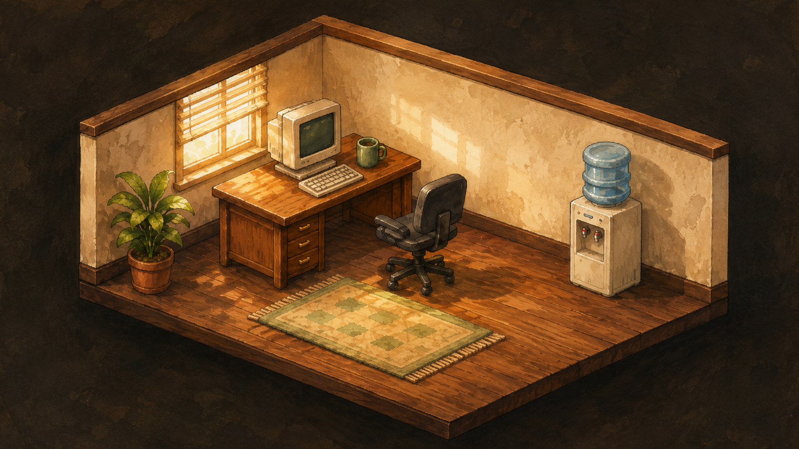
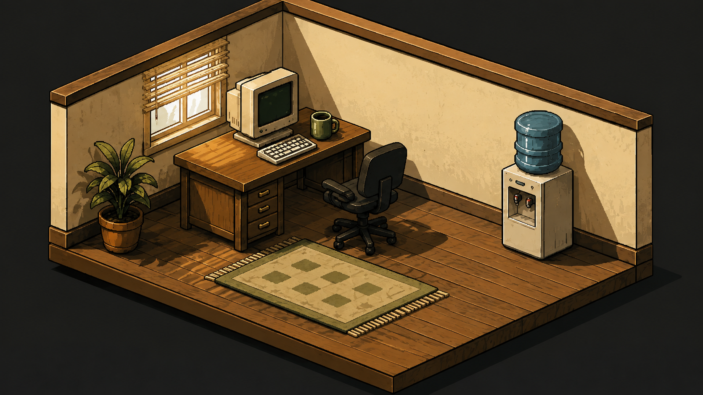
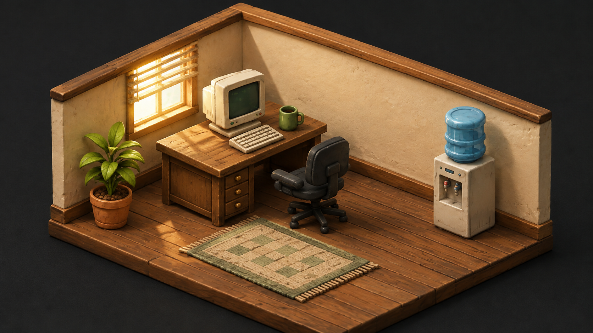
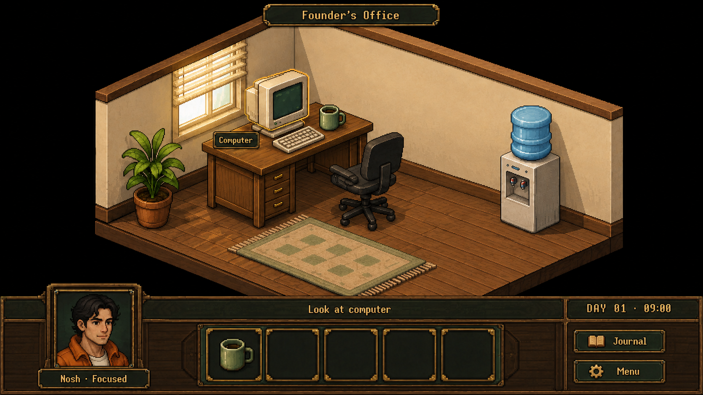
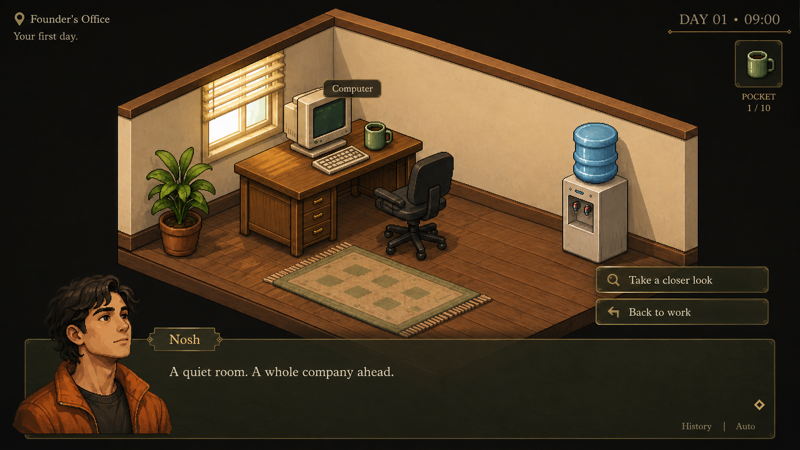
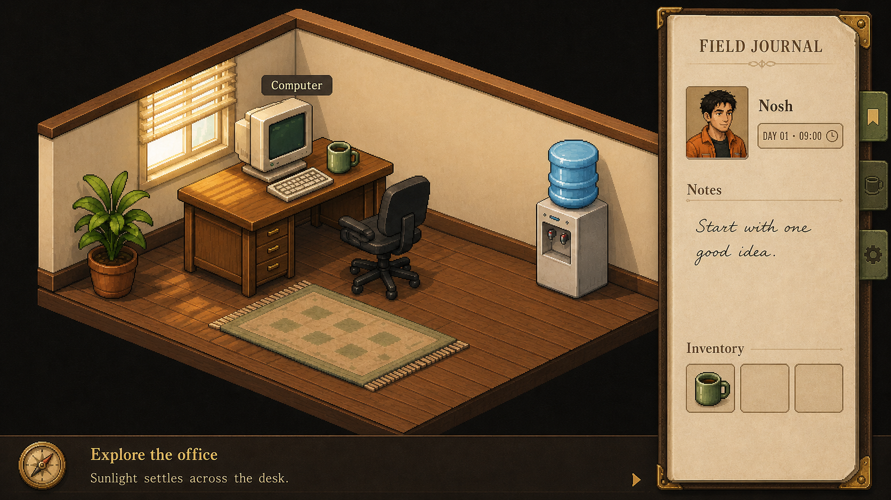

# Founder’s office — style round 01

Exploratory mockups only. Game implementation is paused. Generated with the built-in OpenAI imagegen tool using the approved founder-office painting as reference. These are not runtime replacements. UI copy and controls are illustrative.

## Room styles

### room-01-storybook

### room-02-graphic-cel

### room-03-handcrafted

## Shell / UI concepts

### ui-01-classic-adventure

### ui-02-visual-novel

### ui-03-field-journal

